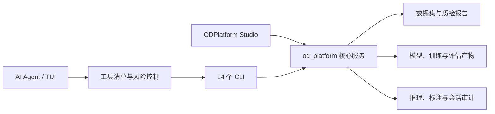

# ODPlatform（目标检测开发平台）

ODPlatform 是一个本地优先的端到端目标检测开发平台。它以 Python 服务层为核心，同时提供 14 个 CLI、PySide6 桌面工作台 **ODPlatform Studio**，以及可连接 OpenAI 兼容模型的 AI Agent 和 VLM 自动标注能力。

项目覆盖数据导入、格式转换、数据质检、人工/VLM 标注、YOLO 模型训练、评估、推理与结果审计，适合目标检测课程实践、算法验证和单机工作站原型开发。

> 当前版本为 `0.0.1`（Alpha）。已打通的端到端主线是 YOLO `detect`；`segment`、OBB、分类和 Web 多用户平台属于后续扩展，不在当前交付范围内。

## 当前能力

| 领域 | 已实现能力 |
| --- | --- |
| 数据工程 | VOC / YOLO zip 导入，VOC / COCO / YOLO 转换，数据划分、dataset yaml 和数据指纹 |
| 数据质量 | 图片与标签配对、标签格式、类别分布、划分唯一性等检查，输出 JSON / Markdown / HTML / CSV / Excel 报告 |
| 标注闭环 | OpenCV 边界框标注与编辑；VLM 批量预标注、断点续跑、原始响应审计和人工复核队列 |
| 模型生命周期 | YOLO v5/v7/v8/v9/v10/11/12 共 34 个内置模型元数据，支持自然语言推荐、训练、评估、曲线绘制和权重归档 |
| 推理 | 图片、目录、视频和摄像头输入，多级流水线、暂停/取消、结果落盘和中文标签可视化 |
| 桌面工作台 | 推理控制、任务启动、模型目录、评估/质检/训练结果浏览、标注复核和 AI 助手 |
| AI Agent | OpenAI 兼容接口、REPL / Textual TUI、多轮会话恢复、工具编排、风险分级、确认机制和任务模板 |
| 工程质量 | Monorepo + `src` 布局，Pydantic 配置，结构化日志，pytest / Ruff / mypy 配置和可测试的桌面纯函数层 |

## 架构概览



桌面端保持薄 UI：`main.py` 负责应用装配，功能逐步拆分到 `views/`、`controllers/` 和 `services/`；训练、推理、质检和标注逻辑统一复用 `od_platform` 服务层或 CLI，不在界面层复制业务实现。

```text
ODPlatform/
├─ apps/
│  ├─ platform/                 # od_platform 核心包、CLI 与测试
│  ├─ desktop/                  # PySide6 桌面工作台
│  └─ web-backend/              # Web 后端占位，当前未实现
├─ data/                        # raw / processed 等本地数据目录
├─ models/                      # 预训练、训练权重和检查点
├─ runs/                        # 训练、评估、推理、标注与 Agent 产物
├─ docs/                        # 架构决策、运维和 QA 文档
├─ requirements.txt             # GitHub 快速安装依赖入口
└─ pyproject.toml               # 全仓开发工具配置
```

## 快速开始

项目要求 Python 3.10 或更高版本。当前开发环境统一使用 Conda 环境 `odplat`。

```powershell
git clone https://github.com/Qinling-Melon-Farmers/ODPlatform-NPU-Yolo.git
cd ODPlatform-NPU-Yolo

conda activate odplat
python -c "import sys; print(sys.executable)"
pip install -r requirements.txt
pip install -e ./apps/platform
```

`requirements.txt` 用于从仓库快速复现环境；平台包依赖的权威声明位于 `apps/platform/pyproject.toml`。主要 CLI 启动时会检查解释器是否来自 `odplat`，不匹配时给出 warning，但不会阻断运行。

### 启动桌面工作台

```powershell
conda activate odplat
python apps/desktop/main.py
```

ODPlatform Studio 当前包含实时推理、任务启动、模型目录、训练/评估/质检结果、标注复核和 AI 助手等页面。训练、VLM 自动标注等高成本入口默认提供 dry-run 或确认保护。

### 跑通目标检测主线

下面以 VOC 格式的 Steel 数据集为例：

```powershell
# 1. 导入数据集
odp-import-dataset "..\steel surface defect.v1i.voc.zip" `
  --name steel-surface-defect --format voc --overwrite

# 2. 转换、划分并生成 dataset yaml
odp-transform --dataset steel-surface-defect --format pascal_voc --task detect

# 3. 数据质检
odp-validate --dataset steel-surface-defect --executor your-name

# 4. 训练
odp-train --yaml train --data steel-surface-defect --model yolo11n.pt `
  --epochs 100 --batch 16 --imgsz 640 --device 0 --workers 4 `
  --name steel-defect-yolo11n

# 5. 评估
odp-val --config val --model models/trained/<best-dir>/best.pt `
  --data steel-surface-defect --device 0

# 6. 图片目录推理
odp-infer --model models/trained/<best-dir>/best.pt `
  --source data/processed/steel-surface-defect/test/images `
  --conf 0.25 --device 0 --name steel-defect-test --threaded
```

对于包含 `data.yaml`、`images/<split>/` 和 `labels/<split>/` 的 YOLO 数据集，应按 YOLO 格式导入：

```powershell
odp-import-dataset "..\liftrace.zip" --name liftrace --format yolo --overwrite
odp-transform --dataset liftrace --format yolo --task detect
odp-validate --dataset liftrace --executor your-name
```

## AI Agent

Agent 将自然语言请求转换为平台工具调用，复用现有 CLI 和服务层。它支持会话持久化、历史恢复、工具事件流、风险分级、确认机制和预设任务模板。

```powershell
# REPL：连接任意 OpenAI 兼容接口
odp-agent --base-url https://api.deepseek.com/v1 --model deepseek-chat

# Textual TUI
odp-agent --tui --base-url https://api.deepseek.com/v1 --model deepseek-chat

# 任务模板
odp-agent --template train_and_evaluate `
  --task "用 yolo11n 训练 liftrace 50 轮" `
  --base-url https://api.deepseek.com/v1 --model deepseek-chat
```

会话默认保存在 `runs/agent_sessions/`。涉及写文件、API 消耗或 GPU 长任务的工具会进入相应风险级别；实际执行前应检查命令预览和确认范围。

## VLM 自动标注

`odp-auto-annotate` 可连接 Qwen-VL、GLM-4.5V 等 OpenAI 兼容视觉模型，使用自然语言要求生成 YOLO 边界框标注。运行过程会保留报告、原始响应和复核队列，供桌面标注复核页继续精修。

```powershell
$env:OPENAI_API_KEY = "<your-api-key>"

# 先检查待处理范围，不调用 API
odp-auto-annotate --dataset liftrace --prompt "框出所有目标" `
  --base-url <openai-compatible-endpoint> --model <vision-model> --dry-run
```

审计产物默认位于 `runs/annotation/<run_id>/`。批量写入标签前建议先使用 `--dry-run`，并抽样检查模型响应与类别映射。

## CLI 一览

| 命令 | 用途 |
| --- | --- |
| `odp-init` | 初始化项目运行目录 |
| `odp-reset` | 清理运行产物；默认 dry-run，可先备份 |
| `odp-import-dataset` | 导入 VOC 或 YOLO 数据集 zip |
| `odp-transform` | 转换、划分、落盘并生成 dataset yaml 与指纹 |
| `odp-validate` | 执行数据质检并生成多格式报告 |
| `odp-gen-config` | 生成 train / val / infer runtime 配置 |
| `odp-train` | 训练 YOLO 模型并归档日志、manifest、曲线和权重 |
| `odp-val` | 评估模型并生成指标与审计记录 |
| `odp-infer` | 对图片、目录、视频或摄像头执行推理 |
| `odp-plot-training` | 从 `results.csv` 绘制训练曲线并导出摘要 |
| `odp-list-models` | 浏览和推荐内置 YOLO 模型 |
| `odp-annotate` | 创建或编辑 YOLO 边界框标注 |
| `odp-auto-annotate` | 使用 VLM 自动预标注并生成复核队列 |
| `odp-agent` | 使用自然语言编排平台任务 |

## 运行产物

| 路径 | 内容 |
| --- | --- |
| `data/raw/` | 导入后的原始数据集 |
| `data/processed/` | 转换、划分后的训练数据 |
| `models/trained/` | 归档后的最佳/最终模型权重 |
| `runs/detect/` | 默认 `detect` 训练日志、指标、manifest 和曲线 |
| `runs/evaluation/` | 模型评估结果 |
| `runs/inference/` | 推理图片、视频和结构化结果 |
| `runs/data_validation/` | 数据质检报告与返工清单 |
| `runs/annotation/` | VLM 标注审计与人工复核队列 |
| `runs/agent_sessions/` | Agent 多轮会话历史 |

数据集、模型权重、日志和运行产物默认不进入 Git。仓库只保留目录说明、代码和可复现配置。

## 开发与验证

```powershell
conda activate odplat
python -m ruff check apps/platform/src/od_platform apps/desktop scripts
python -m pytest apps/platform/src/od_platform/tests -q
python -m compileall apps/desktop
```

平台采用 Monorepo + `src` 布局。路径操作统一使用 `pathlib.Path`，业务输出通过日志层，软依赖在边界处降级。架构决策记录位于 [`docs/architecture/`](docs/architecture/)，桌面端细节见 [`apps/desktop/README.md`](apps/desktop/README.md)。

## 当前边界

- 当前是面向本地研发和教学实践的 Alpha 项目，不应直接视为生产系统。
- 已验证的完整任务类型是目标检测 `detect`；其他视觉任务尚未形成端到端闭环。
- Web 后端仅保留目录占位；当前交付界面是 PySide6 桌面端、CLI 和 Textual TUI。
- GPU 训练、摄像头、第三方视觉模型和具体 YOLO 权重需要对应的本地硬件、文件与服务配置。
- API 凭据应通过环境变量或受控配置传入，不应写入仓库、日志或共享命令记录。
